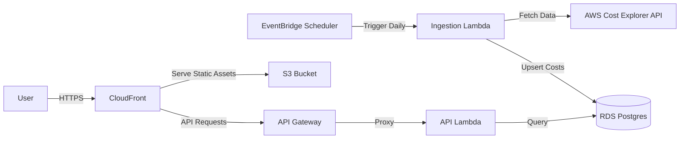

# Architecture Overview

This document describes the high-level architecture of the AWS Cost Optimizer.

## Data Flow

The system follows a serverless, event-driven architecture designed for low cost and high scalability.

**Flow Description:**
1. **Ingestion**: An Amazon EventBridge rule triggers the Ingestion Lambda once a day. This Lambda fetches cost data from the AWS Cost Explorer API and upserts it into the RDS Postgres database.
2. **Frontend**: Users access the React application via CloudFront. Static assets are hosted in S3.
3. **API**: The frontend makes requests to the API Gateway. Detailed requests are routed to the API Lambda, which queries the RDS database for cost summaries, trends, and recommendations.

## AWS Services

| Service | Role | Justification |
| :--- | :--- | :--- |
| **Lambda** | Compute | Serverless, pay-per-use, perfect for sporadic ingestion and API traffic. |
| **API Gateway** | API Management | RESTful entry point for the backend, handles throttling and routing. |
| **RDS (Postgres)** | Database | Relational data model suits structured cost data and complex analytical queries. |
| **S3** | Storage | Hosts the frontend static assets reliably and cheaply. |
| **CloudFront** | CDN | Delivers the frontend globally with low latency and TLS termination. |
| **Cognito** | Auth | Managed authentication (User Pool) eliminates need for custom auth backend. |
| **EventBridge** | Scheduler | Reliable cron-like scheduling for the ingestion pipeline. |
| **Terraform** | IaC | Declarative infrastructure management ensures reproducibility. |

## Tradeoffs & Future Improvements

- **RDS vs DynamoDB**: Detailed analytical queries (aggregation, filtering) are easier in SQL. DynamoDB would require complex pre-aggregation.
- **Monolith Lambda**: Starting with a single API function ("Lambdalith") for simplicity. Can split into micro-functions later if cold starts or bundle size become issues.
- **Latency**: No caching layer (Redis) initially. AWS Cost Explorer data changes daily, so query caching could be added to the API Lambda or via ElastiCache if read volume increases.
- **Security**: Basic private subnet isolation is used. WAF could be added to CloudFront/ALB for production hardening.
